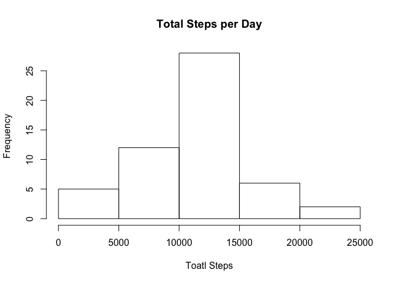
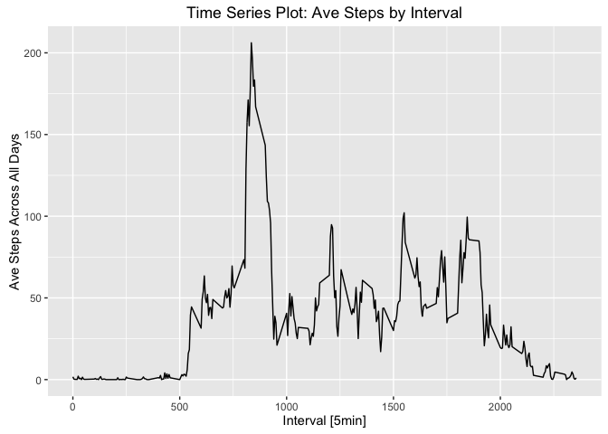

# Reproducible Research: Peer Assessment 1
JAbagat  
October 6, 2016  

Set global options: 


## Loading and preprocessing the data

```r
# Load the data
filePath <- "/Users/joselle4/Documents/Programming/R/coursera/activity.csv"
activity <- read.csv(filePath, header = TRUE, na.strings = "NA")
activityClean <- na.omit(activity)
```

## What is mean total number of steps taken per day?
For this part of the assignment, ignore the missing values in the dataset.

1. Calculate the total number of steps taken per day

```r
# Calculate mean steps per day
meanDailySteps <- aggregate(activity$steps, 
                       by = list(activity$date),
                       FUN = mean)
colnames(meanDailySteps) <- c("date", "steps")
head(meanDailySteps)
```

```
##         date    steps
## 1 2012-10-01       NA
## 2 2012-10-02  0.43750
## 3 2012-10-03 39.41667
## 4 2012-10-04 42.06944
## 5 2012-10-05 46.15972
## 6 2012-10-06 53.54167
```

```r
# Calculate the total number of steps taken per day
sumDailySteps <- aggregate(activity$steps, 
                       by = list(activity$date),
                       FUN = sum)
colnames(sumDailySteps) <- c("date", "steps")
summary(sumDailySteps)
```

```
##          date        steps      
##  2012-10-01: 1   Min.   :   41  
##  2012-10-02: 1   1st Qu.: 8841  
##  2012-10-03: 1   Median :10765  
##  2012-10-04: 1   Mean   :10766  
##  2012-10-05: 1   3rd Qu.:13294  
##  2012-10-06: 1   Max.   :21194  
##  (Other)   :55   NA's   :8
```

```r
head(sumDailySteps)
```

```
##         date steps
## 1 2012-10-01    NA
## 2 2012-10-02   126
## 3 2012-10-03 11352
## 4 2012-10-04 12116
## 5 2012-10-05 13294
## 6 2012-10-06 15420
```

2. If you do not understand the difference between a histogram and a barplot, research the difference between them. Make a histogram of the total number of steps taken each day

```r
# Make a histogram of the total number of steps taken each day
hist(sumDailySteps$steps, xlab = "Toatl Steps", 
     main = "Total Steps per Day")
```

<!-- -->

3. Calculate and report the mean and median of the total number of steps taken per day

```r
# Calculate and report the mean and median of the total number
# of steps taken per day
mean(sumDailySteps$steps, na.rm = TRUE)
```

```
## [1] 10766.19
```

```r
median(sumDailySteps$steps, na.rm = TRUE)
```

```
## [1] 10765
```

## What is the average daily activity pattern?
1. Make a time series plot (i.e. 𝚝𝚢𝚙𝚎 = "𝚕") of the 5-minute interval (x-axis) and the average number of steps taken, averaged across all days (y-axis)

```r
# load required library
library(ggplot2)

# calcualte the average steps 
aveStepsByInterval <- aggregate(activity$steps ~ activity$interval, 
                                FUN = mean)
colnames(aveStepsByInterval) <- c("interval", "steps")
summary(aveStepsByInterval)
```

```
##     interval          steps        
##  Min.   :   0.0   Min.   :  0.000  
##  1st Qu.: 588.8   1st Qu.:  2.486  
##  Median :1177.5   Median : 34.113  
##  Mean   :1177.5   Mean   : 37.383  
##  3rd Qu.:1766.2   3rd Qu.: 52.835  
##  Max.   :2355.0   Max.   :206.170
```

```r
head(aveStepsByInterval)
```

```
##   interval     steps
## 1        0 1.7169811
## 2        5 0.3396226
## 3       10 0.1320755
## 4       15 0.1509434
## 5       20 0.0754717
## 6       25 2.0943396
```

```r
# create time series plot
gg <- ggplot(data = aveStepsByInterval, aes(x = interval, y = steps)) + 
    geom_line() + xlab("Interval [5min]") + 
    ylab("Ave Steps Across All Days") + 
    ggtitle("Time Series Plot: Ave Steps by Interval")
gg
```

<!-- -->

2. Which 5-minute interval, on average across all the days in the dataset, contains the maximum number of steps?

```r
# use which function to obtain max number of steps per interval
aveStepsByInterval[which.max(aveStepsByInterval$steps), ]
```

```
##     interval    steps
## 104      835 206.1698
```

## Imputing missing values
1. Calculate and report the total number of missing values in the dataset (i.e. the total number of rows with 𝙽𝙰s

```r
sum(is.na(activity))
```

```
## [1] 2304
```

2. Devise a strategy for filling in all of the missing values in the dataset. The strategy does not need to be sophisticated. For example, you could use the mean/median for that day, or the mean for that 5-minute interval, etc.


3. Create a new dataset that is equal to the original dataset but with the missing data filled in.


4. Make a histogram of the total number of steps taken each day and Calculate and report the mean and median total number of steps taken per day. Do these values differ from the estimates from the first part of the assignment? What is the impact of imputing missing data on the estimates of the total daily number of steps?


## Are there differences in activity patterns between weekdays and weekends?
1. Create a new factor variable in the dataset with two levels – “weekday” and “weekend” indicating whether a given date is a weekday or weekend day.


2. Make a panel plot containing a time series plot (i.e. 𝚝𝚢𝚙𝚎 = "𝚕") of the 5-minute interval (x-axis) and the average number of steps taken, averaged across all weekday days or weekend days (y-axis). See the README file in the GitHub repository to see an example of what this plot should look like using simulated data.


