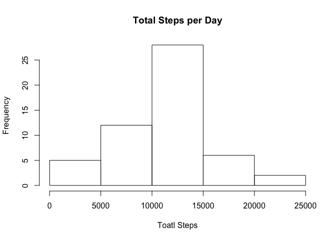

# Reproducible Research: Peer Assessment 1
JAbagat  
October 6, 2016  

Set global options: 


## Loading and preprocessing the data

```r
# Load the data
filePath <- "/Users/joselle4/Documents/Programming/R/coursera/activity.csv"
activity <- read.csv(filePath, header = TRUE, na.strings = "NA")
```

## What is mean total number of steps taken per day?

```r
# Calculate mean steps per day
meanDailySteps <- aggregate(activity$steps, 
                       by = list(activity$date),
                       FUN = mean)
colnames(meanDailySteps) <- c("date", "steps")

# Calculate the total number of steps taken per day
sumDailySteps <- aggregate(activity$steps, 
                       by = list(activity$date),
                       FUN = sum)
colnames(sumDailySteps) <- c("date", "steps")
summary(sumDailySteps)
```

```
##          date        steps      
##  2012-10-01: 1   Min.   :   41  
##  2012-10-02: 1   1st Qu.: 8841  
##  2012-10-03: 1   Median :10765  
##  2012-10-04: 1   Mean   :10766  
##  2012-10-05: 1   3rd Qu.:13294  
##  2012-10-06: 1   Max.   :21194  
##  (Other)   :55   NA's   :8
```

```r
# Make a histogram of the total number of steps taken each day
hist(sumDailySteps$steps, xlab = "Toatl Steps", 
     main = "Total Steps per Day")
```

<!-- -->

```r
# Calculate and report the mean and median of the total number
# of steps taken per day
mean(sumDailySteps$steps, na.rm = TRUE)
```

```
## [1] 10766.19
```

```r
median(sumDailySteps$steps, na.rm = TRUE)
```

```
## [1] 10765
```

## What is the average daily activity pattern?

```r
# Make a time series plot (i.e. 𝚝𝚢𝚙𝚎 = "𝚕") of the
# 5-minute interval (x-axis) and the average number of steps 
# taken, averaged across all days (y-axis)

# Which 5-minute interval, on average across all the days in 
#the dataset, contains the maximum number of steps?
```


## Imputing missing values


## Are there differences in activity patterns between weekdays and weekends?
